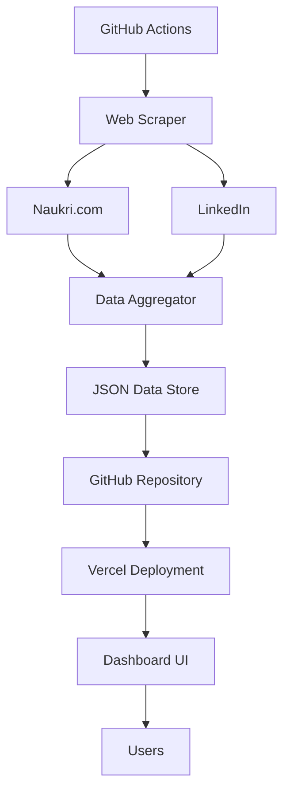

# India Job Insights 🇮🇳

[](https://vercel.com/new/clone?repository-url=https://github.com/yourusername/india-job-insights)
[](https://github.com/yourusername/india-job-insights/actions)
[](https://opensource.org/licenses/MIT)

> **Production-ready dashboard providing real-time insights into the Indian tech job market with automated daily data collection from Naukri and LinkedIn.**

## 🚀 Live Demo

Visit the live dashboard: [**india-job-insights.vercel.app**](https://your-domain.vercel.app)

## ✨ Features

### 📊 **Comprehensive Analytics**
- **Technology Trends**: Track demand for JavaScript, Python, React, and 25+ technologies
- **Geographic Distribution**: Analyze job opportunities across 12+ major Indian cities
- **Experience Levels**: Insights for freshers to senior professionals
- **Company Insights**: Top hiring companies and their recruitment patterns
- **Salary Analytics**: Compensation trends and ranges (when available)

### 🔄 **Automated Data Pipeline**
- **Daily Data Collection**: Automated scraping via GitHub Actions
- **Data Quality Assurance**: Validation, deduplication, and error handling
- **Historical Tracking**: Trend analysis with 30-day moving averages
- **Real-time Updates**: Dashboard refreshes automatically

### 🎨 **Modern Dashboard**
- **Responsive Design**: Optimized for desktop, tablet, and mobile
- **Interactive Charts**: Built with Recharts for beautiful visualizations
- **Dark/Light Mode**: Adaptive theme support
- **Filter System**: Multi-dimensional filtering by technology, city, experience
- **Export Features**: Download reports as CSV/PDF

### ⚡ **Production Architecture**
- **Next.js 14**: Server-side rendering and API routes
- **TypeScript**: End-to-end type safety
- **Tailwind CSS**: Utility-first styling with custom components
- **Vercel Deployment**: Edge functions and global CDN
- **GitHub Actions**: CI/CD with automated workflows

## 🏗️ Architecture



## 🛠️ Tech Stack

| Layer | Technology |
|-------|------------|
| **Frontend** | Next.js 14, React 18, TypeScript |
| **Styling** | Tailwind CSS, Framer Motion |
| **Charts** | Recharts, D3.js |
| **Data** | JSON files in GitHub repository |
| **Scraping** | Puppeteer, Cheerio, p-queue |
| **Deployment** | Vercel, GitHub Actions |
| **Monitoring** | Vercel Analytics, Speed Insights |

## 🚦 Getting Started

### Prerequisites

- Node.js 18+
- npm or yarn
- Git

### 1. Clone & Install

```bash
git clone https://github.com/yourusername/india-job-insights.git
cd india-job-insights
npm install
```

### 2. Environment Setup

```bash
cp .env.example .env.local
```

Configure your environment variables:

```env
NEXT_PUBLIC_SITE_URL=http://localhost:3000
NEXT_PUBLIC_APP_VERSION=1.0.0
NODE_ENV=development
```

### 3. Initial Data Collection

```bash
# Run the scraping script (requires good internet connection)
npm run scrape

# Start development server
npm run dev
```

Open [http://localhost:3000](http://localhost:3000) to view the dashboard.

## 📦 Deployment

### Deploy to Vercel (Recommended)

1. **Fork this repository**
2. **Connect to Vercel**: Import your forked repository
3. **Environment Variables**: Set production environment variables
4. **Deploy**: Automatic deployment on every push to main

[](https://vercel.com/new/clone?repository-url=https://github.com/yourusername/india-job-insights)

### Manual Deployment

```bash
npm run build
npm start
```

## 🔧 Configuration

### Scraping Configuration

Modify `scripts/scrape-jobs.ts` to customize:

```typescript
const SCRAPING_CONFIG = {
  technologies: ['JavaScript', 'Python', 'React', /* ... */],
  cities: ['Bangalore', 'Mumbai', 'Delhi', /* ... */],
  experienceLevels: ['fresher', '1-3', '4-6', '7+'],
  maxJobsPerQuery: 25
};
```

### GitHub Actions

The daily data collection runs automatically. To modify the schedule, edit `.github/workflows/daily-scraping.yml`:

```yaml
schedule:
  # Run daily at 6:00 AM IST (00:30 UTC)
  - cron: '30 0 * * *'
```

## 📊 Data Schema

### Job Posting Structure

```typescript
interface JobPosting {
  id: string;
  title: string;
  company: string;
  location: string;
  experience: string;
  salary?: string;
  technologies: string[];
  source: 'naukri' | 'linkedin';
  postedDate: string;
  scrapedAt: string;
}
```

### Dashboard Data Structure

```typescript
interface DashboardData {
  summary: {
    totalJobs: number;
    totalCompanies: number;
    lastUpdated: string;
  };
  technologies: TechnologyStats[];
  cities: CityStats[];
  experienceLevels: ExperienceStats[];
  trends: TrendData;
  companies: CompanyStats[];
}
```

## 🧪 Development

### Scripts

```bash
npm run dev          # Start development server
npm run build        # Build for production
npm run start        # Start production server
npm run lint         # Run ESLint
npm run type-check   # TypeScript type checking
npm run scrape       # Manual data collection
npm test             # Run tests
```

### Project Structure

```
india-job-insights/
├── .github/workflows/     # GitHub Actions
├── data/                  # Generated data files
├── public/               # Static assets
├── scripts/              # Data collection scripts
├── src/
│   ├── app/             # Next.js app directory
│   ├── components/      # React components
│   ├── contexts/        # React contexts
│   ├── lib/            # Utility libraries
│   └── types/          # TypeScript definitions
├── vercel.json         # Vercel configuration
└── package.json
```

## 🔍 Monitoring & Analytics

### Built-in Monitoring

- **Performance**: Vercel Speed Insights
- **Analytics**: Vercel Analytics
- **Error Tracking**: Built-in error boundaries
- **Data Quality**: Automated validation checks

### Health Checks

The application includes several health check endpoints:

- `/api/health` - Application health
- `/api/dashboard-data` - Data availability
- GitHub Actions status badges

## 🤝 Contributing

We welcome contributions! Here's how to get started:

1. **Fork the repository**
2. **Create a feature branch**: `git checkout -b feature/amazing-feature`
3. **Make your changes** with proper tests
4. **Commit your changes**: `git commit -m 'Add amazing feature'`
5. **Push to branch**: `git push origin feature/amazing-feature`
6. **Open a Pull Request**

### Contribution Guidelines

- Follow TypeScript best practices
- Add tests for new features
- Update documentation
- Ensure responsive design
- Maintain accessibility standards

## 📜 License

This project is licensed under the MIT License - see the [LICENSE](LICENSE) file for details.

## 🙏 Acknowledgments

- **Data Sources**: Naukri.com and LinkedIn
- **UI Inspiration**: Modern dashboard design patterns
- **Open Source**: Built with amazing open-source technologies

## 📞 Support

- **Issues**: [GitHub Issues](https://github.com/yourusername/india-job-insights/issues)
- **Discussions**: [GitHub Discussions](https://github.com/yourusername/india-job-insights/discussions)
- **Email**: your-email@domain.com

---

**⭐ Star this repository if you find it helpful!**

Built with ❤️ for the Indian tech community.